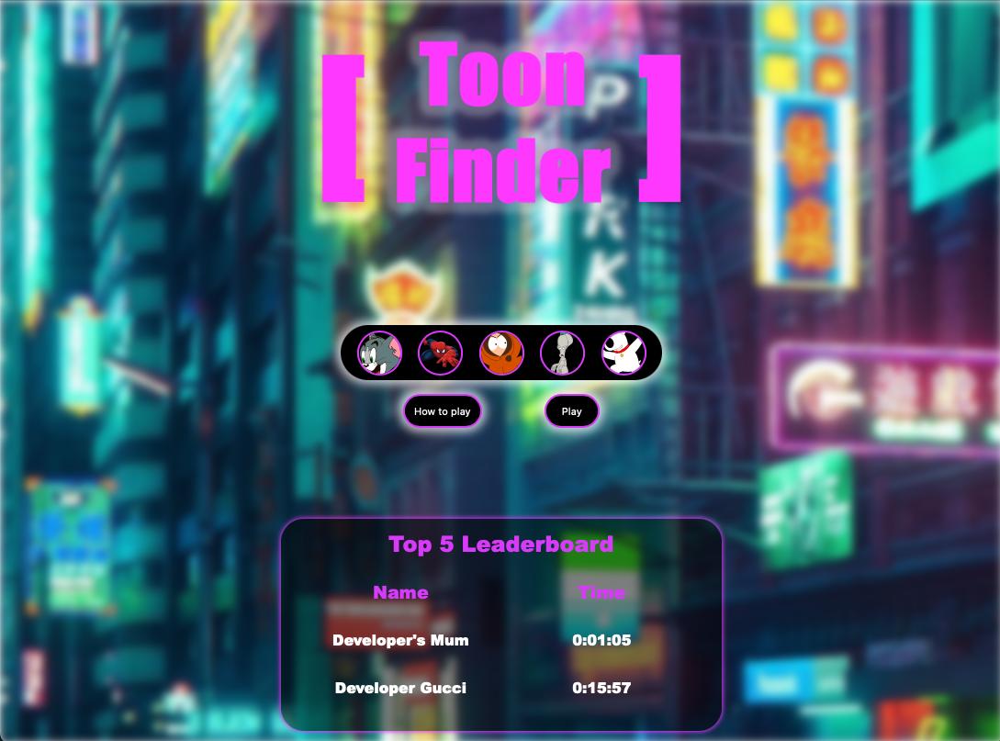
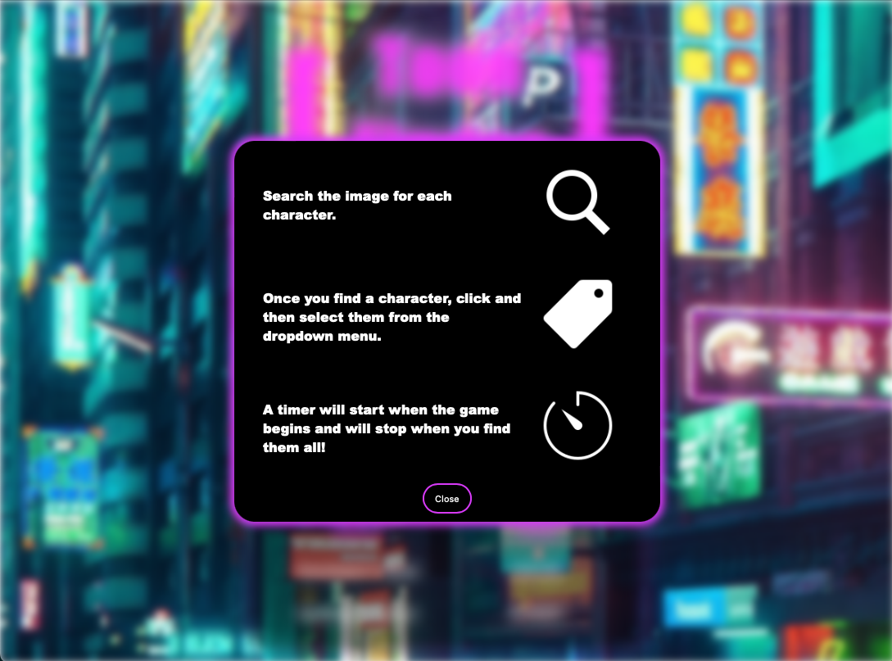
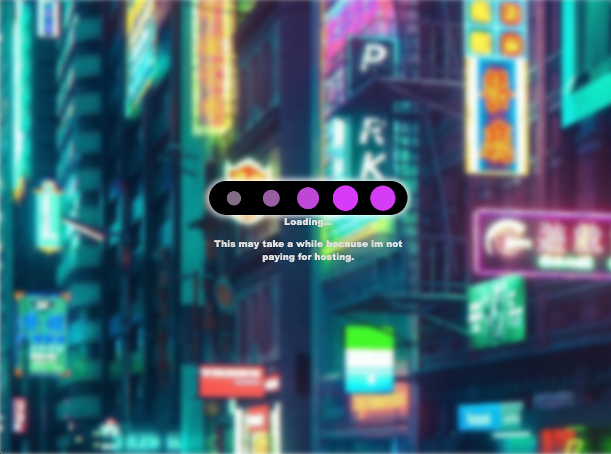
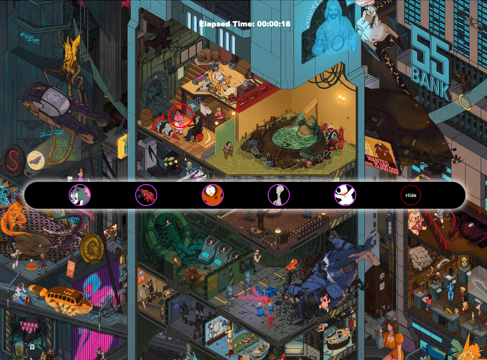

# Toon Finder

---

## About this project

This is project was set by the Oding Project as the forst of 3 final full stack projects designed to showcase everythign thats been taught in the full course. 

This is a 'Wheres Waldo' inspired web based game where users try to find characters as quickly as possible. Give it a try!

---

## Technologies

JS
CSS
React
NodeJS
MongoDB

---

## Screenshots

### Picture 1

### Picture 2

### Picture 3

### Picture 4

